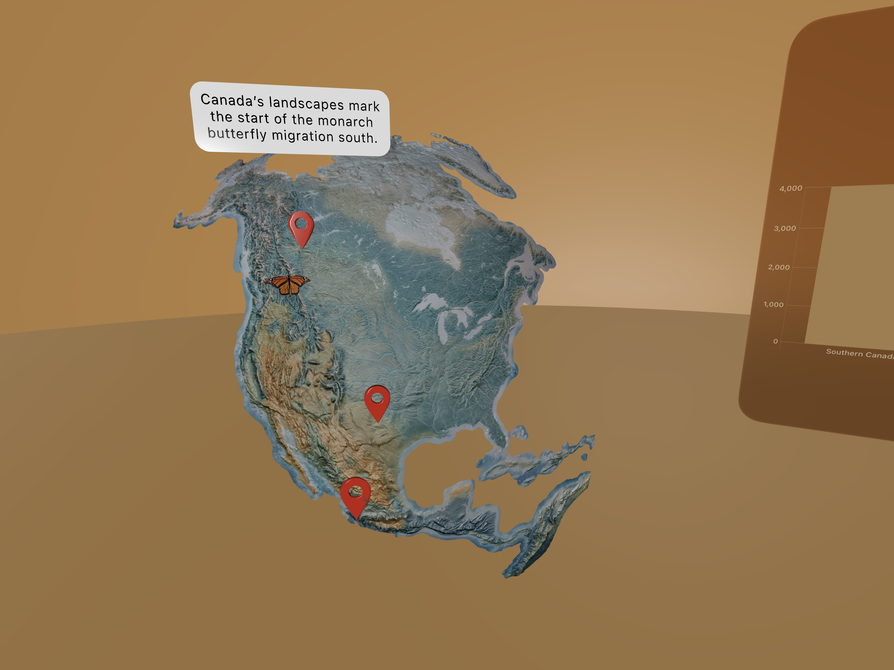
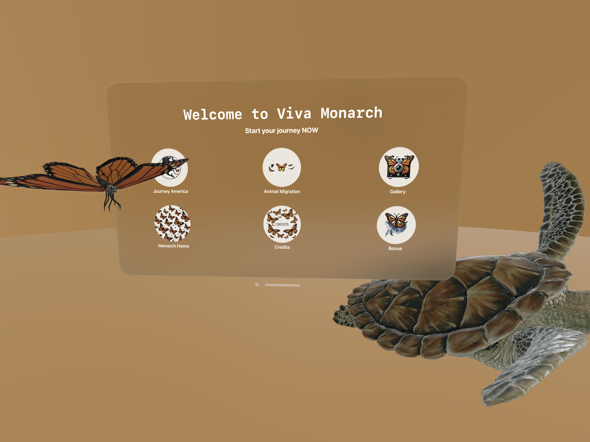
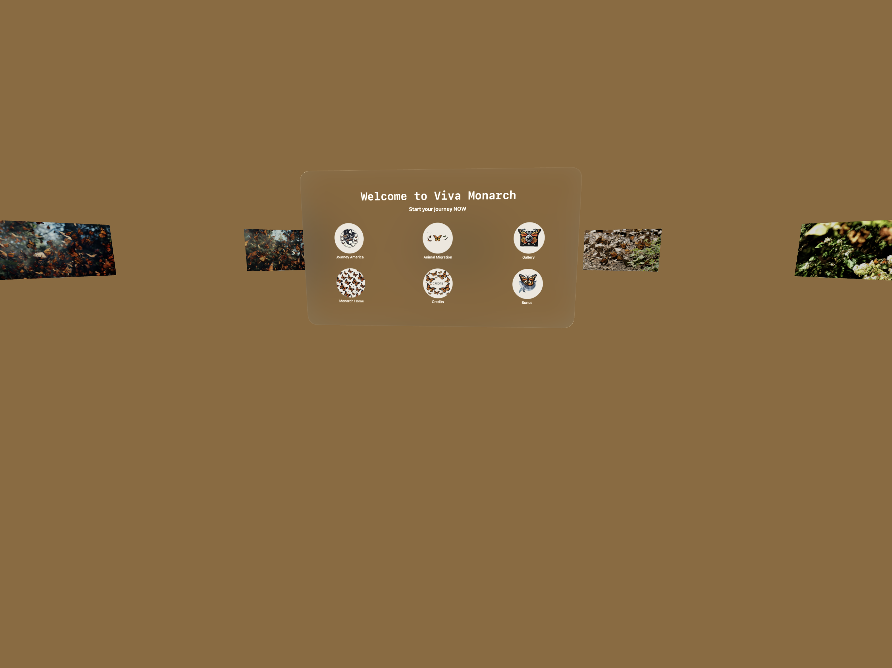

# VivaMonarch

Experience the mesmerizing journey of the Monarch butterfly and explore the natural world in 360 degrees with VivaMonarch on Vision Pro.

## Overview

VivaMonarch is an immersive Vision Pro experience where users can interactively explore the world of Monarch butterflies. From understanding their migration patterns to learning about their habitats and other migratory species, VivaMonarch combines stunning visuals with educational content, emphasizing ecological awareness and the interconnectedness of all life.

## Monarch Butterfly Hub

[Welcome To Viva Monarch](DemoMaterial/WelcomeToVivaMonarch.mp4)

Experience the incredible world of monarch butterflies in 360°! Journey to the breathtaking breeding grounds in Michoacán, where millions of these majestic creatures gather in vibrant clusters. Discover the sights and sounds of their migration, witness their delicate wings up close, and gain a unique perspective on the monarch's lifecycle and conservation efforts.

## Monarch Butterflies through America

[AmericaMap](DemoMaterial/AmericaMap.mp4)

Experience the 3D Map of America and follow the remarkable journey of the monarch butterfly from Canada to Mexico! Explore each stage of their migration and learn about the challenges and triumphs along the way. Click on the red pins to dive into each part of the monarch’s route and discover fascinating details about this iconic migration.

## Animal Migration

[Animal Migration](DemoMaterial/MigrationAnimals.mp4)

Migration is not just the story of the monarch butterfly; it’s a journey shared by countless other animals like sea turtles, birds, and more. This immersive hub brings the wonder of migration to life, surrounding you with the sights and sounds of these incredible creatures as they make their seasonal journeys. Step into the wild and experience the world through the eyes of animals on the move.

## Photo Gallery

[PhotoGallery](DemoMaterial/PhotoGallery.mp4)

We've also included a photo gallery featuring stunning images from our journey to Mexico. Explore snapshots of vibrant landscapes, close-up encounters with monarchs, and the beautiful surroundings that make this migration so special.

## Bonus Material

[BonusWhaleMigration](DemoMaterial/BonusWhaleMigration.mp4)

Migration is a journey that connects us all, crossing borders, ecosystems, and even oceans. It’s not only monarch butterflies that embark on these incredible voyages—whales are also among nature’s great travelers. Each year, various whale species migrate vast distances, some traveling thousands of miles to reach warmer breeding waters or richer feeding grounds. These migrations are essential for their survival, but they also highlight the delicate balance of our global ecosystem.

## Credits

[Credits](DemoMaterial/Credits.mp4)

Credits go out to Jan Steinhauer (janst.geo@gmail.com) for developing the app and bringing it to life, as well as for appearing in some of our Instagram reels. Follow along on Instagram at [@viva.monarch](https://www.instagram.com/viva.monarch/). A heartfelt thank you to Cynthia Mendoza for managing our social media and helping share our story. And a special thank you to the Presidential Global Learner Award for making this project possible!

